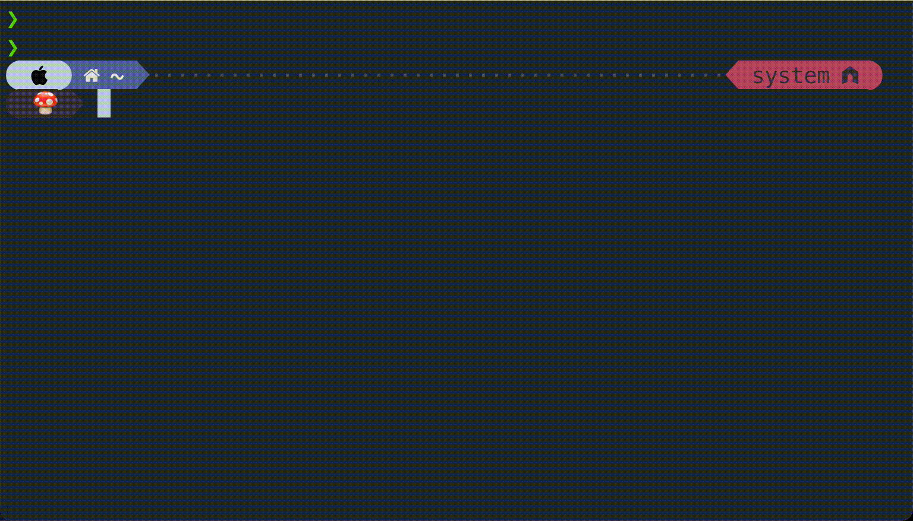

# Random Emoji Prompts in Your Terminal (Powerlevel10k)

**Features Include** 
- A new emoji shown every new line
- Subtle reminder to eat
  - Ever get so focused that you forget all about eating? During mealtime ranges, food emojis will be shown instead. 

## Example
Example outside of meal time:


## Prerequisite
Have [powerlevel10k](https://github.com/romkatv/powerlevel10k) installed already.

## Steps
In ~/.p10k.zsh, define
```
  FOODMOJIS=(🥖 🍤 🥑 🥐 🌽 🍆 🍕 🥙 🌮 🍱 🍣 🍙 🍚 🌯 🍔 🍟 🍖)
  EMOJIS=(✨ 🌈 🌻 🍄 🍦 🎄 🐲 🦀 👾 💩 😻 🤖 👽 ⚡️ 🍬 🎀 🐸 📚 🆒 🥁 🐙 🦩 🌞 🙀 💰 🏝 🛸 🎮)
  function prompt_random_emoji() {
    HOUR=10#$(date -j +%H);
    if [[ ($HOUR -ge 7 && $HOUR -lt 9) ]]; then
      SELECTED_EMOJI=🍳;
    elif [[ ($HOUR -ge 11 && $HOUR -lt 13) || \
      ($HOUR -ge 18 && $HOUR -lt 20) ]]; then
      SELECTED_EMOJI=${FOODMOJIS[$RANDOM % ${#FOODMOJIS[@]}]};
    else
      SELECTED_EMOJI=${EMOJIS[$RANDOM % ${#EMOJIS[@]}]};
    fi
    p10k segment -t "${SELECTED_EMOJI}"
  }
```

Then, in the same file, find `POWERLEVEL9K_LEFT_PROMPT_ELEMENTS`, which defines the left side of the prompt output. Put `random_emoji` where you want it to appear in the prompt.

Save and open a new terminal, or enter `source ~/.p10k.zsh`.

### Customization
You can change any of the emojis used in the list or the food emoji meal time ranges.
